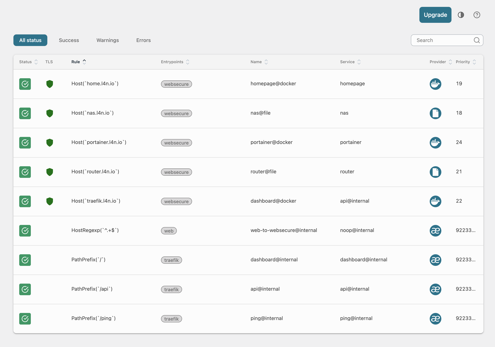
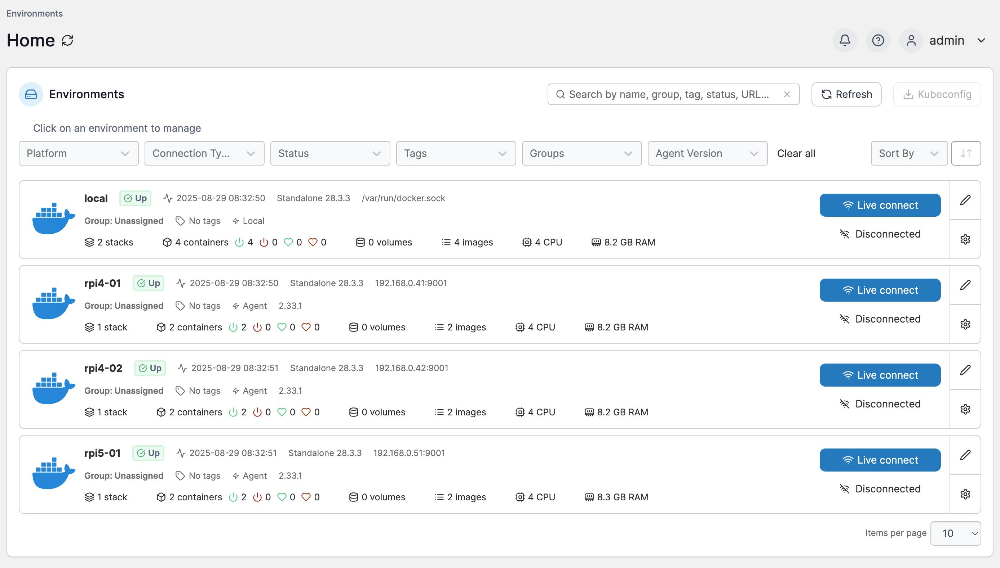
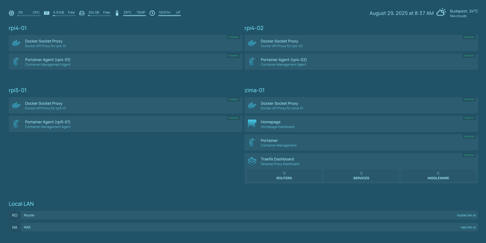

# Building a Multi-Tier Home Lab

> [!IMPORTANT]  
> IMPORTANT NOTE: I am fully aware that I'm exposing my username, some local paths and my internal network structure in the documentation and in the codebase. This is for educational purposes, I am OK with it.

To adjust the configuration to your own environment, please replace `akora` with your username and adjust the IP addresses and hostnames in the `inventory/hosts` file.

Everything sensitive is stored in the `vault.yml` file (not included in the repository). Please check the `vault.yml.example` file for more details and examples.

The domain name I'm using locally is `l4n.io`. I own this domain and in Cloudflare this domain name is pointing to the local IP address where Traefik is running.

With all this said, let's begin!

## Generate SSH keypair

The very first thing you need to do is to generate an SSH keypair. This will be used to enable passwordless authentication and will also allow Ansible to work seamlessly.

```bash
ssh-keygen -t ed25519 -f "~/.ssh/homelab_ed25519" -N "" -C "homelab access key"
```

## Copy SSH key to remote hosts

Copy the public key to all remote hosts. This is manual, no need for a fancy script at this stage.

```bash
ssh-copy-id -i ~/.ssh/homelab_ed25519.pub akora@192.168.0.41
ssh-copy-id -i ~/.ssh/homelab_ed25519.pub akora@192.168.0.42
ssh-copy-id -i ~/.ssh/homelab_ed25519.pub akora@192.168.0.51
ssh-copy-id -i ~/.ssh/homelab_ed25519.pub akora@192.168.0.91
```

## Ping all hosts

Test connectivity and make sure everything is working.

```bash
ansible all -m ping
```

You should see SUCCESS for each host. ping/pong

## Security Hardening

To avoid man-in-the-middle attacks, it's important to enable host key checking. Not critical for a home lab, but recommended.

### Add Host Keys to known_hosts

```bash
ssh-keyscan -H 192.168.0.41 192.168.0.42 192.168.0.51 192.168.0.91 >> ~/.ssh/known_hosts
```

### Update Ansible Configuration

Update `ansible.cfg` to enable `host_key_checking`:

```ini
host_key_checking = True
```

## Check OS versions

This is just another test (of connectivity) and a confirmation that we have matching OS versions on all hosts.

```bash
ansible all -m shell -a 'cat /etc/lsb-release | grep DISTRIB_DESCRIPTION'
```

At the time of writing, all hosts are running Ubuntu 24.04.3 LTS.

NEXT: reaching "baseline" level, Tier ONE!

## Tier ONE: Baseline Configuration

Run the baseline playbook:

```bash
ansible-playbook ansible/playbooks/baseline.yml
```

For the very first run you may need to add `--ask-become-pass` to the command.

This will apply the following changes:

- Update package cache
- Upgrade all packages
- Install common packages
- Set system locale
- Set timezone to UTC
- Ensure sudo is installed
- Configure password-less sudo for admin user
- Secure SSH server
- Set kernel parameters for security

## Tier TWO: Docker Installation

Run the Docker playbook:

```bash
ansible-playbook -i ansible/inventory/hosts ansible/playbooks/docker.yml
```

This will apply the following changes:

- Install required packages for Docker
  - Install Docker packages on ARM
  - Install Docker packages on x86_64
- Create docker group
- Add admin user to docker group
- Install Docker Compose
- Create docker config directory
- Configure Docker daemon
- Enable and start Docker service
- Verify Docker installation
- Verify Docker Compose installation
- Create Docker Compose files directory
- Check existing ACLs for Docker Compose directory
- Set additional permissions for Docker Compose directory
- Ensure setfacl is installed (for ACL management)

## Tier THREE: Traefik & Portainer Installation

Run the Traefik playbook:

```bash
ansible-playbook -i ansible/inventory/hosts ansible/playbooks/traefik.yml
```

This will apply the following changes:

- Create Traefik directories
- Create Traefik network
- Create acme.json file with proper permissions
- Create Traefik configuration files
- Deploy Traefik container

If all goes well, you should be able to access the Traefik dashboard at <https://traefik.l4n.io>.



Note on this screenshot that I have the exisiting services all configured, plus I have a few "static" routing configured as well, for my router and for my NAS.

Next: Portainer!

Run the Portainer playbook:

```bash
ansible-playbook -i ansible/inventory/hosts ansible/playbooks/portainer.yml
```

This will apply the following changes:

- Create Portainer directories
- Stop and remove existing Portainer container if exists
- Check if Docker network exists
- Create Docker network if it doesn't exist
- Create Portainer configuration files
- Deploy Portainer container

If all goes well, you should be able to access the Portainer dashboard at <https://portainer.l4n.io>.



Note on this screenshot that what's captured here is a state _AFTER_ I linked all standalone "agents" to be able to see and manage all of the other servers from one place.

Next: Portainer Agent!

Run the Portainer Agent playbook:

```bash
ansible-playbook -i ansible/inventory/hosts ansible/playbooks/portainer-agent.yml
```

This will apply the following changes:

- Create Portainer Agent directories
- Stop and remove existing Portainer Agent container if exists
- Check if Docker network exists
- Create Docker network if it doesn't exist
- Deploy Portainer Agent container

Setting up the agents made it possible to link them to the main Portainer instance and manage them from one place.

## Tier FOUR: Homepage (& Docker Socket Proxy) Installation

Next: Docker Socket Proxy!

```bash
ansible-playbook ansible/playbooks/docker-socket-proxy.yml
```

This will apply the following changes:

- Create Docker Socket Proxy directories
- Stop and remove existing Docker Socket Proxy container if exists
- Check if Docker network exists
- Create Docker network if it doesn't exist
- Deploy Docker Socket Proxy container

This makes it possible for Homepage to auto-discover services running on the other servers.

Next: Homepage!

```bash
ansible-playbook ansible/playbooks/homepage.yml
```

This will apply the following changes:

- Create Homepage directories
- Stop and remove existing Homepage container if exists
- Check if Docker network exists
- Create Docker network if it doesn't exist
- Deploy Homepage container

If all goes well, you should be able to access the Homepage dashboard at <https://home.l4n.io>.



Finally! We've got something to look at! :)

At this stage you should be able to see all the services running on all servers, nicely represented.

## Tier FIVE: Gitea Git Service

This tier deploys Gitea, a self-hosted Git service, complete with a robust backup and restore system.

### Deployment

To deploy Gitea, use the provided management script:

```bash
./scripts/manage-gitea.sh deploy
```

The script will run the Ansible playbook, and upon completion, it will display the Gitea URL and initial admin credentials.

### Initial User Setup

For security, user registration is disabled by default. To create your first user account, follow these steps:

1. **Enable Registration**: Open the `ansible/playbooks/gitea-with-backup.yml` file and comment out the `gitea_disable_registration` variable:

   ```yaml
   # In ansible/playbooks/gitea-with-backup.yml
   ...
   vars:
     ...
     # Disable user registration
     # gitea_disable_registration: "true"
   ```

2. **Deploy Gitea**: Run the deployment command again to apply the change:

   ```bash
   ./scripts/manage-gitea.sh deploy
   ```

3. **Register Your Account**: Navigate to your Gitea URL (e.g., `https://git.l4n.io`) and register your user account through the web interface.

4. **Disable Registration**: Once you have created your account, uncomment the `gitea_disable_registration` line in `ansible/playbooks/gitea-with-backup.yml` to secure your instance:

   ```yaml
   # In ansible/playbooks/gitea-with-backup.yml
   ...
   vars:
     ...
     # Disable user registration
     gitea_disable_registration: "true"
   ```

5. **Re-deploy**: Run the deployment one last time to disable registration:

   ```bash
   ./scripts/manage-gitea.sh deploy
   ```

### Managing the Admin Account

The playbook configures the user `akora` as the administrator. If you need to reset the password for this user, you can use the management script:

```bash
./scripts/manage-gitea.sh reset-password
```

This command will generate a new random password for the `akora` user and display it in the console.

## Syncthing - Continuous File Synchronization

Syncthing is a continuous file synchronization program that synchronizes files between two or more computers in real time. This setup deploys Syncthing with Traefik integration for secure remote access.

### Deployment of Syncthing

1. **Deploy Syncthing**:

   ```bash
   ansible-playbook ansible/playbooks/syncthing.yml
   ```

2. **Access the Web UI**:
   - Open `https://sync.l4n.io` in your browser
   - The default configuration disables remote discovery and relay servers for security
   - The web interface is secured with your wildcard SSL certificate

### Configuration

Key configuration options (set in `ansible/roles/syncthing/defaults/main.yml`):

```yaml
# Port configuration
syncthing_gui_port: "8384"        # Web GUI port
syncthing_listen_port: "22000"    # File transfer port
syncthing_discovery_port: "21027" # Local discovery (UDP)

# Security
syncthing_restrict_to_lan: true   # Restrict access to local network
syncthing_allowed_networks:
  - "192.168.0.0/24"             # Adjust to your LAN subnet

# Storage
syncthing_data_directory: "/opt/docker/syncthing/data"
syncthing_config_directory: "/opt/docker/syncthing/config"
```

### Security Features

- **TLS Encryption**: All traffic is encrypted using the wildcard SSL certificate
- **Local Network Only**: By default, access is restricted to your local network
- **No Remote Discovery**: Remote discovery and relay servers are disabled
- **File-based Authentication**: Uses the Syncthing web interface for user management

### Adding New Devices

1. Open the Syncthing web interface
2. Click "Add Remote Device"
3. Enter the Device ID of the remote device
4. Select which folders to share
5. Accept the connection request on the remote device

### Troubleshooting

- If you can't access the web interface, check if Traefik is running and the DNS is correctly pointing to your server
- For sync issues, check the Syncthing logs:

  ```bash
  docker logs syncthing
  ```

- Ensure the required ports (8384, 22000, 21027/udp) are open in your firewall

### Backup

Your Syncthing data is stored in the configured data directory (`/opt/docker/syncthing/data` by default). Ensure this directory is included in your regular backup routine.
